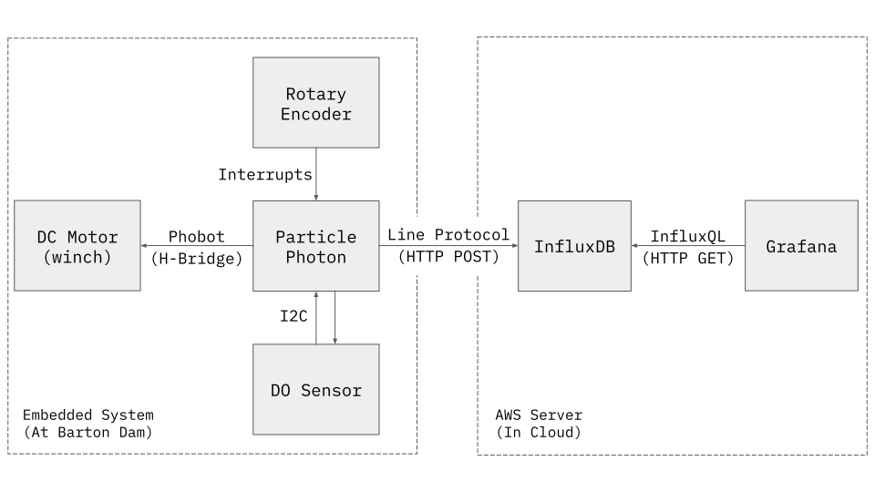

# Bloom Boys
> Collect dissolved oxygen depth profiles

This code was written for a first year college engineering project with 4 other students. It runs on a Particle Photon and enables automatic collection of dissolved oxygen depth profiles by controlling a winch, reading DO concentration from a probe, and sending measurements to a cloud database. The prototype was deployed in Barton Pond, Ann Arbor's drinking water source, and the data it gathers will hopefully allow for better local prediction of algal blooms and lake overturn. It uses I2C to communicate with the probe, and a quadrature encoder to reliably position it at certain depths. To store and visualize data, this system also depends on a cloud server with InfluxDB and Grafana.

## Architecture Diagram

